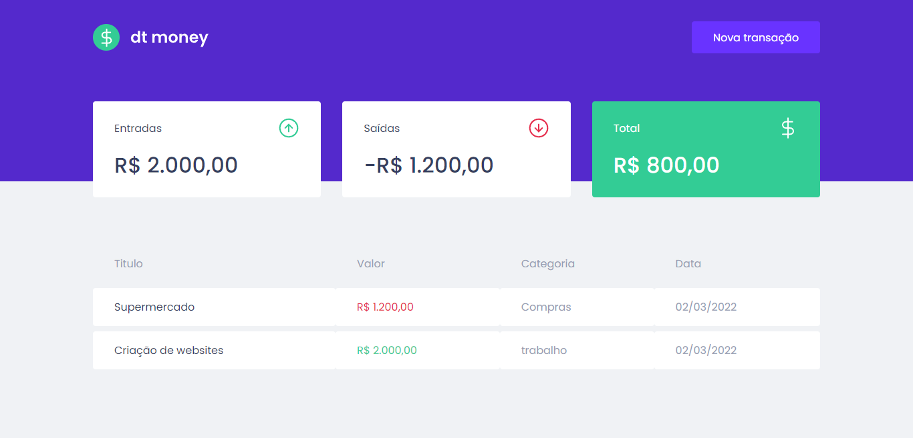

<div align="center">


</div>

<h3 align="center">
 Aplicação para inscrição de newsletter com pagamento via stripe
</h3>

<p align="center">
 <a href="#tecnologias">Tecnologias</a> • 
 <a href="#instalacao">Instalação</a> • 
 <a href="#autor">Autor</a>

</p>

<div align="center">


</div>

<div id="tecnologias">

### 🛠 Tecnologias

As seguintes ferramentas foram usadas na construção do projeto:

- [React](https://pt-br.reactjs.org/)
- [Styled-Components](https://styled-components.com/) 
- [Vite](https://vitejs.dev/) 
- [miragejs](https://miragejs.com/)
- [TypeScript](https://www.typescriptlang.org/)

</div>
<div id="instalacao">

## Pré-requisitos

Antes de começar, você vai precisar ter instalado em sua máquina as seguintes ferramentas:
[Git](https://git-scm.com),
[Node.js](https://nodejs.org/en/),
[Yarn](https://yarnpkg.co)


Além disto é bom ter um editor para trabalhar com o código como [VSCode](https://code.visualstudio.com/)

```bash

# Clone este repositório
$ git clone https://github.com/aldovani/dtmoney

# Acesse a pasta do projeto no terminal/cmd
$ cd dtmoney

# Instale as dependências
$ yarn


# Execute a aplicação em modo de desenvolvimento
$ yarn dev

# O servidor inciará na porta:3000 - acesse <http://localhost:3000>

```

</div>
<div id="autor">

### Autor

---

<a href="https://links-aldovani.netlify.app/">
 
 <br />
 <sub><b>Aldovani Henrique</b></sub></a> <a href="https://links-aldovani.netlify.app/" >🚀</a>

Feito com ❤️ por Aldovani Henrique 👋🏻 Entre em contato!

[](https://www.linkedin.com/in/aldovani-henrique-da-costa-2a460b21a/)
[](mailto:aldovanihcosta@gmail.com)

</div>
